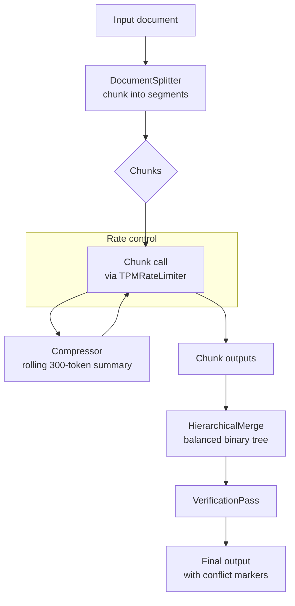

# limitless-llm

[](https://opensource.org/licenses/MIT) [](https://www.python.org/downloads/) [](https://console.groq.com) [](https://github.com/sunishbharat/limitless-llm)

Most chunking tools stop at the chunk boundary. Most rate-limit workarounds ignore document structure. The gap between them, scheduling, budget tracking, merging, and conflict detection is what causes 429 errors and lost information on free-tier APIs.

**limitless-llm fills that gap.** It splits large documents into semantically coherent chunks, schedules each API call within your free-tier TPM budget, and merges the outputs back into a single coherent result.

**Who this is for:** Developers, students, and researchers who want to run serious LLM workflows on large documents without paying for API access. If you have a Groq free-tier key and a document larger than the context window, this tool handles the rest.

| Approach | Cost for a 50k-token document | 429 risk | Code-safe splitting |
|---|---|---|---|
| Paid API (e.g. GPT-4o) | ~$0.50-$1.00 | None | Partial |
| Groq free tier, naive loop | $0 | High | No |
| Splitter-only (LangChain, ASTChunk) | $0 | High | Yes |
| Groq free tier + **limitless-llm** | $0 | None | Roadmap |

**Design goal:** approach the quality of a paid-API workflow on free-tier hardware. The pipeline is designed to target >= 90% fidelity (composite score: BERTScore F1, context recall, faithfulness, conflict marker integrity) against a pinned benchmark corpus.

> **What's working:** TPM-aware request scheduling, rolling-window rate limiting, bidirectional overlap, hierarchical merge with conflict detection, and verification pass. **Want to help extend it?** See [Contributing](#contributing) for open feature areas.

*Formal benchmark results are in progress - see `benchmark/` for methodology.*

---

## How it works



The rate limiter uses a rolling 60-second window. It measures actual input tokens before each call, reserves budget atomically, and records actual usage after. This eliminates 429 errors without fixed sleeps.

---

## Requirements

- Python 3.11+
- [uv](https://github.com/astral-sh/uv) (recommended) or pip
- Any Free Tier API key for your chosen provider (Groq, OpenAI, etc.)

---

## Installation

```bash
git clone https://github.com/sunishbharat/limitless-llm.git
cd limitless-llm
uv sync
```

To install as a CLI tool globally:

```bash
uv pip install -e .
```

---

## API key setup

Set the appropriate environment variable for your provider before running:

| Provider | Environment variable |
|---|---|
| Groq | `GROQ_API_KEY` |
| OpenAI | `OPENAI_API_KEY` |
| Ollama (local) | No key required |

```bash
export GROQ_API_KEY=your_key_here
```

---

## Quick start

Process a document file and print the result to stdout:

```bash
uv run limitless-llm run my_document.txt
```

Save the output to a file:

```bash
uv run limitless-llm run my_document.txt --output result.txt
```

Use a different model:

```bash
uv run limitless-llm run my_document.txt --model groq/llama-3.1-8b-instant
```

Use a smaller chunk size for dense or symbol-heavy documents:

```bash
uv run limitless-llm run my_document.txt --chunk-size 3000
```

---

## Programmatic use case: reviewing a large document

The CLI wraps a single call. To integrate the pipeline into your own application - for example, reading a large spec into the library and getting back a single coherent review - use the Python API.

### Minimal example

```python
import asyncio
from limitless_llm import PipelineFactory
from limitless_llm.models.config import ModelConfig, PipelineConfig

config = PipelineConfig(
    model=ModelConfig(model="groq/llama-3.3-70b-versatile"),
    input_text=open("my_document.txt").read(),
)
result = asyncio.run(PipelineFactory.build(config).run())
print(result)
```

### Install

```bash
uv add limitless-llm
```

Set your provider key before running:

```bash
export GROQ_API_KEY=your_groq_key_here
```

### Recipe: review a huge document on free-tier Groq

```python
# review.py
import asyncio
import pathlib

from limitless_llm import PipelineFactory
from limitless_llm.models.config import ModelConfig, PipelineConfig


REVIEW_SYSTEM_PROMPT = (
    "You are a senior technical reviewer. Read each section of the document carefully "
    "and produce a structured review covering: correctness, risks, ambiguities, and "
    "concrete suggestions. Be specific and quote line ranges when relevant."
)

REVIEW_CHUNK_TEMPLATE = """\
Review the following document section in the context of everything reviewed so far.

{compressed_summary}{tail}DOCUMENT SECTION:
{chunk}

FACTS LEDGER SO FAR:
{ledger}

Produce the review of THIS section only. Do not repeat earlier sections.
"""


async def review_document(document_text: str) -> str:
    config = PipelineConfig(
        model=ModelConfig(
            model="groq/llama-3.3-70b-versatile",
            max_output_tokens=1500,
            baseline_chunk_size=6000,
        ),
        input_text=document_text,
        system_prompt=REVIEW_SYSTEM_PROMPT,
        chunk_prompt_template=REVIEW_CHUNK_TEMPLATE,
    )
    runner = PipelineFactory.build(config)
    return await runner.run()


if __name__ == "__main__":
    text = pathlib.Path("big_spec.pdf").read_text(encoding="utf-8")
    review = asyncio.run(review_document(text))
    pathlib.Path("review.md").write_text(review, encoding="utf-8")
    print(f"Review written: {len(review):,} chars")
```

Run with `uv run python review.py`.

### What you get back

The returned string is the hierarchical merge of every chunk review. By default it also includes two analysis sections, both of which can be suppressed independently:

- **chunked reviews** - one per ~6,000-token slice, merged in a balanced binary tree, so a 20k-token document is ~4 chunks plus 1 merge instead of one giant prompt that triggers 429s
- **bidirectional overlap** - each chunk sees a 200-token tail of the previous section plus a rolling 300-token compressed summary, so defined terms and forward references survive across chunk boundaries
- **no 429s** - the rolling-window TPM limiter reserves budget before each call and records actuals after; `retry-after` is honoured on the rare 429 that still slips through
- **`[CONFLICT: ...]` markers** preserved verbatim and collected in a `## Conflicts Requiring Human Review` section at the end (suppress with `include_conflict_summary=False`)
- **verification report** appended after the merge - costs one extra LLM call against TPM budget (suppress with `include_verification_report=False`)

### Knobs you may want to tune

| Want | Change |
|---|---|
| Bigger context, paid API (no TPM cap) | `model="openai/gpt-4o"` (limiter becomes a no-op) |
| Use `llama-3.1-8b-instant` (6k TPM - lower than 70b) | also set `baseline_chunk_size=3500` or request exceeds the limit |
| Smaller chunks for very dense or symbolic documents | `baseline_chunk_size=3000` |
| Longer per-call output | `max_output_tokens=2000` |
| Your own review checklist | edit `REVIEW_SYSTEM_PROMPT` and `REVIEW_CHUNK_TEMPLATE` |
| Clean output with no appended sections (no verification, no conflict summary) | `include_conflict_summary=False, include_verification_report=False` |
| Clean output but still run verification | `include_conflict_summary=False` |
| Skip the verification LLM call to save TPM budget | `include_verification_report=False` |
| See chunk-by-chunk progress, TPM reservations, and retry logs | `verbose=True` |

### Honest wall-clock cost

For a 20,000-token document on the default Groq free tier, expect ~9 LLM calls (4 chunks + 4 compressions + 1 merge) at roughly 1.25 calls per minute TPM-saturated, so ~3-4 minutes end-to-end. That is the free-tier tradeoff; the point of this library is making it **reliable** (zero 429s) rather than fast. Single-process only - if you run two of these concurrently against the same key, they will not share TPM state and you can 429 again.

---

## CLI reference

### `limitless-llm run`

Process a document through the TPM-aware pipeline.

```
Usage: limitless-llm run [OPTIONS] INPUT_FILE

Arguments:
  INPUT_FILE  Path to the input document  [required]

Options:
  -m, --model TEXT              LiteLLM model identifier
                                [default: groq/llama-3.3-70b-versatile]
  --max-output-tokens INTEGER   Maximum tokens per LLM output call [default: 1500]
  --chunk-size INTEGER          Baseline chunk size in tokens [default: 6000]
  -o, --output PATH             Write output to this file instead of stdout
  --help                        Show this message and exit
```

### `limitless-llm refresh-limits`

Audit the model registry for stale entries and report their age. Exits with a non-zero code if any entry is older than 90 days.

```bash
uv run limitless-llm refresh-limits
```

---

## Supported models

| Model | Context window | Free-tier TPM | Notes |
|---|---|---|---|
| `groq/llama-3.3-70b-versatile` | 128,000 | 12,000 | Default model. Last verified 2026-06-27 |
| `groq/llama-3.1-8b-instant` | 128,000 | 6,000 | Lower TPM than 70b - use `baseline_chunk_size=3500`. Last verified 2026-06-27 |
| `groq/llama3-70b-8192` | 8,192 | 6,000 | No longer listed on Groq free plan as of 2026-06-27 - may be deprecated |
| `openai/gpt-4o` | 128,000 | Unlimited | Paid API - no rate limiting |
| `ollama/llama3.2` | 32,768 | Unlimited | Local - no network limit |
| `openai/minimax-m3` | 40,960 | Unlimited | Paid API |

Unknown models fall back to `context_window=8,192` and `tpm_limit=6,000`.

---

## Output format

Both analysis sections are **on by default** and **independently controllable** via `PipelineConfig` flags.

**Conflict markers** - when chunk outputs contain contradictory facts, inline markers are preserved verbatim:

```
[CONFLICT: left says "March 15", right says "April 1" - preserved for human review]
```

When `include_conflict_summary=True` (default), a structured summary is appended at the end:

```
## Conflicts Requiring Human Review

The following contradictions were detected across document sections
and could not be automatically resolved:

1. [CONFLICT: left says "March 15", right says "April 1" - preserved for human review]
```

Set `include_conflict_summary=False` to omit this section. Note: inline `[CONFLICT: ...]` markers remain in the merged text regardless - only the summary section is suppressed.

**Verification report** - a brief LLM-generated check comparing the merged output against the accumulated fact ledger. Controlled by `include_verification_report` (default `True`):

```
---

## Verification Report

...
```

Setting `include_verification_report=False` skips the verification LLM call entirely, not just the section. The verification call sends `ledger + merged_output` plus prompt overhead and `max_output_tokens`, so on a typical 20k-token document it consumes roughly 6,000-12,000 TPM tokens - significantly more than a single chunk call (the 2,100-token figure elsewhere in the docs refers to the per-chunk *compression* call, not verification).

**Choosing flags by workflow:**

| Workflow | `include_conflict_summary` | `include_verification_report` |
|---|---|---|
| Review mode - full analysis | `True` (default) | `True` (default) |
| Write/fix mode - clean output, still verified | `False` | `True` |
| Fast review - skip verification call | `True` | `False` |
| Generate clean output with no verification | `False` | `False` |

---

## Why not just chunk and loop?

Tools like LangChain's text splitters, `code-chunk`, and `ASTChunk` are excellent at splitting. They stop at the chunk boundary and hand you a list. They do not handle:

- **Token budget tracking** - how many tokens am I about to send, and will this 429 on Groq's 12k TPM limit?
- **Precise sleep scheduling** - sleeping too long wastes time; sleeping too short still 429s
- **Output merging** - combining 4-8 chunk outputs into one coherent result
- **Conflict detection** - what happens when chunk 3 contradicts chunk 6?

limitless-llm is the pipeline layer that sits between your chunks and your API key and answers all of those questions.

---

## Roadmap

**Code-aware splitting** (open contribution)
The current splitter is sentence-aware, not structure-aware. Documents where more than ~20% of content is code blocks will have chunks split at arbitrary boundaries. A structure-aware splitter that protects code block and function boundaries is the designated next step - see [CONTRIBUTING.md](CONTRIBUTING.md).

**Ledger pruning** (open contribution)
The pipeline accumulates all chunk outputs into a running ledger. On very long documents this ledger can exceed the context window, and the pipeline aborts with a clear error before making the API call. Ledger pruning to stay within budget is an open contribution area - see [CONTRIBUTING.md](CONTRIBUTING.md).

**Multi-process TPM sharing** (open contribution)
The rate limiter is in-process. Running two instances against the same API key will each see the full TPM budget independently. A Redis backend is the upgrade path - see [CONTRIBUTING.md](CONTRIBUTING.md).

---

## Wall-clock time expectations

Free-tier APIs are rate-limited. Processing is reliable but slow. Example for a 20,000-token document on `groq/llama-3.3-70b-versatile` (12,000 TPM free tier):

- ~4 chunk calls + ~4 compression calls + ~1 merge call = ~9 total LLM calls
- At TPM saturation: approximately 3-4 minutes end-to-end

This is the honest tradeoff of the free tier. The rate limiter makes it reliable rather than crashy.

---

## Contributing

Bug reports and pull requests are welcome. Please open an issue first to discuss significant changes. See [CONTRIBUTING.md](CONTRIBUTING.md) for open feature areas and contribution guidelines.

---

## License

MIT - see [LICENSE](LICENSE).

---

## Local development

```bash
uv sync                                   # install all dependencies including dev
uv run ruff check limitless_llm/          # lint
uv run ruff format --check limitless_llm/ # format check
uv run mypy --strict limitless_llm/       # type check
uv run python -m pytest                   # run tests
```
